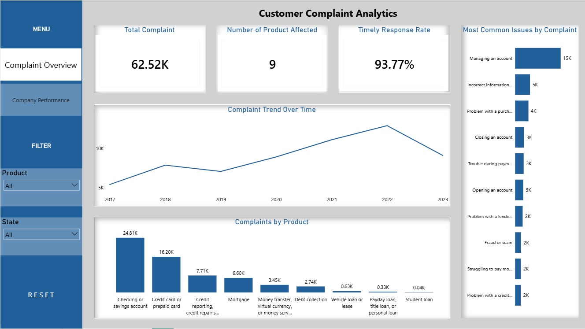
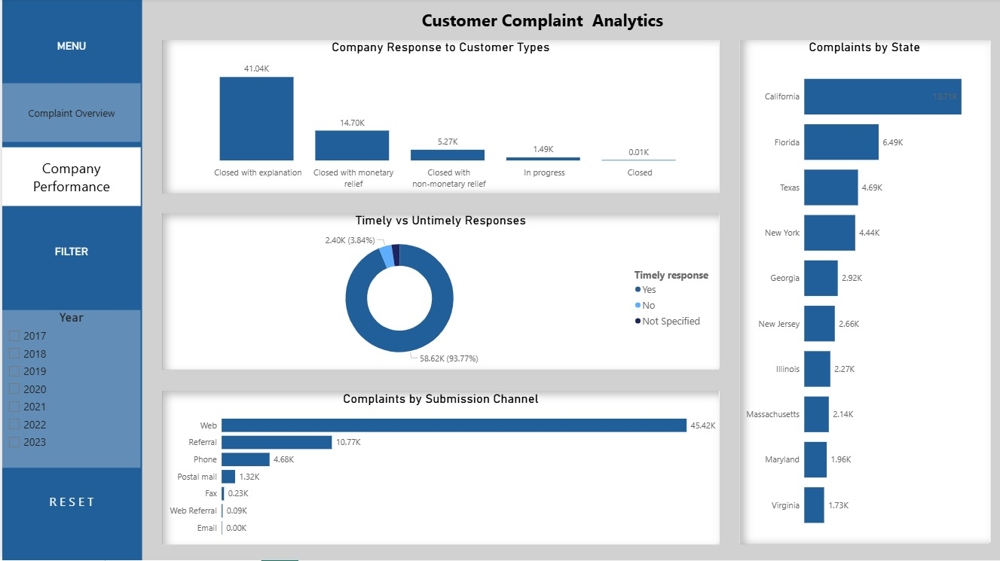

#  Customer Complaint Analytics

This project presents an end-to-end data analysis of customer complaints in the finance industry. The goal of the analysis is to identify complaint trends, evaluate company response performance, and generate insights to support better decision-making.

Interactive dashboards were created using Excel and PowerBI to transform raw data into meaningful and easy to understand visuals.

---

## Table of Content 

## 1. Introduction

1. [Introduction](#introduction)

2. [Project Description](#project-description)

3. [Project Objectives](#project-objectives)

4. [Dataset Overview](#Dataset-Overview)

5. [Tools Used](#tools-used)

6. [Methodology](#methodology)

7. [Data Cleaning and Transformation](#data-cleaning-and-transformation)

8. [Dashboard Preview](#dashboard-preview)

9. [Key Insights](#Key-Insights)

10. [Recommendation](Recommendation)

11. [Conclusion](#Conclusion)

## Introduction

Customer complaints are a critical indicator of service quality and customer satisfaction in the financial industry. Analyzing complaint data helps organizations identify recurring issues, understand customer behavior, and evaluate the effectiveness of their response processes.

This project focuses on analyzing customer complaint data to uncover key trends, assess company performance, and identify areas requiring improvement. By leveraging data visualization and analytical techniques, the study provides actionable insights that support better decision-making and enhance overall customer experience.

## Project Description

This project covers the complete data analysis workflow, including:

- Data collection

- Data cleaning and preparation

- Data transformation

- Data analysis

- Data visualization

- Dashboard development

- Business insights generation

- Recommendations for stakeholders

##  Project Objectives

- Analyze customer complaint trends over time  
- Identify the most affected financial products  
- Evaluate company response performance  
- Understand customer behavior and complaint patterns  
- Provide actionable recommendations for improvement  

## Methodology

**Dataset Overview**

- Total records: **62,516 complaints**  
- Number of columns: **12**  
- Industry: **Finance (Customer Complaints Data)**  

The dataset includes:
- Product categories  
- Complaint issues  
- Submission channels  
- Company responses  
- Response timeliness  
- Geographic locations  
- Complaint dates  

**Business Questions Answered**

- What are the most common customer complaint issues?

- Which products receive the highest complaints?

- Which channels are most frequently used?

- Which states record the highest complaints?

- How have complaints changed over time?

- How effective are companies in providing timely responses?

##  Tools Used

1. Microsoft Excel: Data cleaning, Data inspection, Handling missing values, Data validation

2. Microsoft Power BI: Dashboard creation, Data visualization, KPI development

3. Microsoft PowerPoint: Dashboard wireframing

## Data Cleaning And Transformation
Several cleaning and transformation processes were performed to prepare the dataset for analysis.

**Cleaning Steps Performed**

**1. Handling Missing Values**

- Sub-product → Replaced missing values with "NOT Specified"

- Sub-issue → Replaced missing values with "Not Specified"

- Company Public Response → Replaced with "Not Specified."

- Timely Response → Replaced with "Not Specified"

**2. Standardizing Column Names**

- Removed special characters from column names: renamed Timely Response? → Timely Response

**3. Data Type Validation**

- Verified date columns

- Confirmed categorical columns as text fields

**4. Duplicate Validation**

- Performed duplicate checks, but no duplicate records were found

**5. Dataset Structuring**

- Improved readability

- Standardized naming conventions

- Retained all relevant columns

## 📊 Dashboard Preview

### 🔹 Complaint Overview Dashboard

### 🔹 Company Performance Dashboard

##  Key Insights

**1. 📊 Complaint Volume**
- A total of **62.52K customer complaints** were recorded  
- Complaint volume increased steadily from **2017 to 2022** and declined slightly in 2023  

**2. 🏦 Most Affected Products**
- **Checking / Savings accounts** recorded the highest complaints (~24.81K)  
- Followed by **Credit Card / Prepaid Card complaints**  

**3. ⏱ Timely Response Performance**
- Companies achieved a strong **93.77% timely response rate**  
- Indicates efficient handling of customer complaints  

**4. ⚠️ Most Common Issues**
- Managing an account (highest)  
- Incorrect information on reports  
- Problems with purchases  

**5. 🌐 Complaint Submission Channels**
- Majority of complaints were submitted via the **Web channel (~45K)**  
- Other channels include referral, phone, and postal mail  
- Digital channels are clearly preferred  

**6. 🌍 Geographic Distribution**
- **California** recorded the highest complaints (~13.7K)  
- Followed by Florida, Texas, and New York  

**7.  🏢 Company Response Types**
- Most complaints were resolved through **explanations**  
- Fewer cases resulted in **monetary or non-monetary relief**  

**8. 📊 Timely vs Untimely Responses**
- Majority of responses are timely  
- A small percentage remains delayed, indicating room for improvement  

##  Dashboard Features

- KPI cards (Total complaints, Timely response rate, Products affected)  
- Trend analysis over time  
- Complaint distribution by product  
- Complaint analysis by state  
- Submission channel analysis  
- Company response performance  
- Interactive filters (Year, Product, State)  

## Recommendations

### 1. High Complaint Volume  
**Insight:** A total of 62,516 customer complaints were recorded, indicating significant customer dissatisfaction across financial products and services.

**Recommendation:** Senior management should implement a continuous complaint monitoring system and integrate complaint analysis into strategic decision-making to identify recurring issues and improve overall customer experience 

**Stakeholder:** Executive Management  

### 2. Product Issue Concentration  
**Insight:** Checking or Savings Accounts recorded the highest number of complaints (24.81K complaints). 

**Recommendation:** The Product Management and Operations Teams should review account processes, focusing on transaction delays, fees, account maintenance, and customer communication to reduce complaint volume. 

**Stakeholder:** Product & Operations Teams  

### 3. Account Management Challenges  

**Insight:** The most common complaint issue was “Managing an Account. 

**Recommendation:** The Customer Experience Team should simplify account management processes, improve self-service platforms, and provide clearer guidance to customers.  

**Stakeholder:** Customer Experience Team, Digital Banking Team

###  4. Strong Response Performance  
**Insight:** Companies achieved a strong 93.77% timely response rate, showing effective complaint handling. 

**Recommendation:** Customer Service and Compliance Teams should maintain service standards while investigating delayed responses to achieve near 100% efficiency.

**Stakeholder:** Customer Service Team, Compliance Team

### 5. Complaint Trend Growth  
**Insight:** Customer complaints increased steadily from 2017 to 2022, with a slight decline in 2023

**Recommendation:** The Business Intelligence Team should perform root cause analysis and apply predictive analytics to anticipate and prevent future complaint spikes. 

**Stakeholder:** Business Intelligence Team, Risk Management Team  

 

##  Conclusion

The analysis highlights key patterns in customer complaints and company response performance within the finance industry. While companies demonstrate strong responsiveness, recurring issues and high complaint volumes in certain products and regions indicate opportunities for improvement.

By focusing on customer experience, operational efficiency, and data-driven decision-making, organizations can significantly enhance service quality and reduce complaint rates.

 

